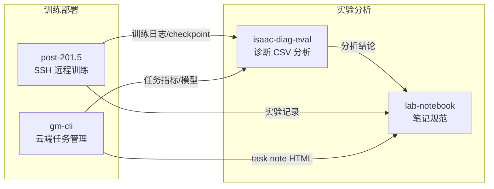

# `.trae/skills` 技能总览

本目录包含 4 个 Agent Skill，覆盖 **远程部署训练**、**Isaac 诊断分析**、**实验笔记规范**、**Gradmotion CLI 操作** 四条工作流。各 Skill 自包含执行流程与约束，Agent 在匹配触发词时应优先读取对应 `SKILL.md`。

---

## 技能一览

| Skill | 目录 | 核心用途 | 典型触发词 |
| --- | --- | --- | --- |
| **post-201.5** | `post-201-5/` | SSH 部署项目到 `10.12.201.5` 并远程恢复/启动训练 | 部署到服务器、发送到 10.12.201.5、rsync/scp、远程训练 |
| **isaac-diag-eval** | `isaac-diag-eval/` | 分析 `isaac_diag_*.csv`，判定本轮训练是否相对上一轮改进 | 是否改进、踝关节抖动、稳定性、速度跟踪、落地冲击 |
| **lab-notebook** | `lab-notebook/` | ML/RL 实验笔记的结构化编号与 Markdown 更新规范 | 记录实验结果、创建新实验、更新实验笔记 |
| **gm-cli** | `gm-cli/` | 操作 Gradmotion CLI（认证、项目/任务、模型下载等） | gm、gm-cli、Gradmotion、task create、checkpoint 下载 |

---

## 1. post-201.5 — 远程 SSH 部署与训练

**路径**：`.trae/skills/post-201-5/SKILL.md`

### 功能

将本地 `agibot_x1_train-runner` 项目通过 SSH 传输到远程服务器 `robot@10.12.201.5`，在 conda 环境 `F1` 中安装依赖，并从指定 checkpoint 恢复训练。

### 关键参数

| 项 | 值 |
| --- | --- |
| 远程主机 | `10.12.201.5`（用户 `robot`，端口 22） |
| 远程目录 | `~/czy/exp1/exp_<YYYYMMDD_HHMMSS>/`（每次新建时间戳目录） |
| conda 环境 | `/home/robot/Anaconda`，环境名 `F1`（Python 3.8.20） |
| 默认训练 | `x1_dh_stand`，`test_20_video`，从 checkpoint 6000 恢复 |

### 标准流程（8 步）

1. **连通性预检** — SSH 登录 + conda/F1 环境验证  
2. **创建时间戳目录** — PowerShell 生成 `exp_yyyyMMdd_HHmmss`  
3. **传输项目** — 优先 rsync（带 exclude）；Windows 回退 scp + 远程清理 `skills/`、`czy/data/`  
4. **传输后验证** — 确认 `train.py` 与 checkpoint（路径含 `exported_data/` 层）  
5. **安装依赖** — `pip install -e .`  
6. **后台启动训练** — `nohup python humanoid/scripts/train.py ...`  
7. **监控训练** — 查进程、日志末尾、GPU 占用  
8. **训练结果验证** — 运行 `play.py`，检查结果目录  

### 重要约束

- 执行前**必须向用户确认**（高影响：写远程磁盘 + 占 GPU）  
- SSH 统一加 `-o BatchMode=yes`（密钥免密）  
- 非交互 SSH 必须先 `source conda.sh` 再 `conda activate F1`  
- `nohup` 导致本地 SSH 超时属正常，**勿重复启动训练**  
- 传输排除 `skills/`（含凭据）、`czy/data/`、`.git/` 等  

---

## 2. isaac-diag-eval — Isaac 诊断 CSV 改进评估

**路径**：`.trae/skills/isaac-diag-eval/SKILL.md`  
**配套脚本**：`.trae/skills/isaac-diag-eval/eval_isaac_diag.py`

### 功能

输入 Isaac 仿真导出的逐 step 诊断日志 `czy/data/isaac_diag_*.csv`，判断**本轮训练相对上一轮是否改进**，并给出可写回实验笔记的分级结论（✅改进 / ⚠️部分改进 / ❌未改进）。

### 分析维度（9 节输出）

| 节 | 内容 |
| --- | --- |
| 0 | 数据覆盖度（能/不能验证哪些目标） |
| cmd | 命令速度/角速度 |
| 1 | 稳定性分窗 + 摔倒判定 |
| 2 | 航向漂移 |
| 3 | 关节高频抖动（FFT，踝关节重点） |
| 4 | 限位 bang-bang（抖动常见根因） |
| 5 | 左右对称性 |
| 6 | 关节力矩量级 |
| 7 | 速度跟踪（`base_lin_vel_x` vs `cmd_linear_x`） |
| 8 | 落地冲击（接触力峰值） |

### 使用方式

```bash
python .trae/skills/isaac-diag-eval/eval_isaac_diag.py czy/data/isaac_diag_<时间戳>.csv
python .trae/skills/isaac-diag-eval/eval_isaac_diag.py <csv> --win 1.0 --hf 5.0
```

### 改进判定逻辑

1. 先读第 0 节，明确 CSV 能验证什么  
2. 逐目标与上一轮 CSV 或笔记记录对比  
3. 改进 = 目标项变好且无新退化  
4. 发现 bang-bang 占比高时，优先提示根因（限位边界）而非调阻尼  
5. 结论写回笔记时遵循 `lab-notebook` 规范  

### 与其他 Skill 的关系

- 与 `walk-diagnostics`（若存在）互补：后者关注对称性/跟踪误差/步态周期，本 Skill 负责「是否改进」的综合判定  
- 分析完成后，结论应写入 `lab-notebook` 规范的实验笔记  

---

## 3. lab-notebook — 实验笔记更新规范

**路径**：`.trae/skills/lab-notebook/SKILL.md`

### 功能

定义 ML/RL 实验笔记的结构化编号规则与 Markdown 正文模板，确保实验历史可追溯、编号一致。

### 实验编号规则

| 类型 | 格式 | 示例 | 适用场景 |
| --- | --- | --- | --- |
| 基础编号 | `实验{N}_{次序号}` | `实验1_0`、`实验1_2` | 文件名数字 + 从 0 起的实验序号 |
| 微调迭代 | `实验{N}_{基序号}t{迭代号}` | `实验1_0t1`、`实验1_0t2` | 权重微调、超参小改、单函数微调 |
| 大变化 | 递增次序号（无 t） | `实验1_1`、`实验1_2` | 新增奖励、改 URDF、改网络结构等 |

### 修改记录规则

- **t 系列微调**：修改编号连续累加（修改一、修改二、修改三…），跨 t 实验继承  
- **大变化实验**：编号前缀改为「实验」，从实验一重新计数  

### 实验正文模板（四部分，顺序固定）

1. **上一实验结果与教训**（必须具体，含数值与现象）  
2. **本轮修改目标**  
3. **修改内容**（含代码、参数对比表、理由）  
4. **预期**（奖励预期变化与异常信号）  

### 注意事项

- 编号一旦分配不可更改；失败实验也要保留记录  
- 大变化判断不清时，宁可不用 `t` 后缀  

---

## 4. gm-cli — Gradmotion CLI 操作指南

**路径**：`.trae/skills/gm-cli/SKILL.md`

### 功能

指导 Agent 使用 `gm` CLI 完成 Gradmotion 平台的认证、配置、项目管理、任务生命周期管理、模型下载与实验笔记同步。

### 主要工作流

| 类别 | 典型命令 |
| --- | --- |
| 认证 | `gm auth login/status/whoami` |
| 配置 | `gm config profile list/set/use` |
| 项目 | `gm project list/create/edit/delete/info` |
| 任务 | `gm task create/edit/copy/list/info/run/stop/delete/logs` |
| 模型 | `gm task model list` → 取 `policUrlDown` 用 curl 下载 |
| 数据 | `gm task data keys/get/download` |
| 笔记/标签 | `gm task note update/get`、`gm task tag update/get` |

### Agent 执行约束

- 危险操作（stop/delete 等）**必须加 `--yes`**（非交互环境否则 exit 2）  
- 写操作推荐先 `--dry-run`（exit 10 表示预览通过）  
- 不回显 API Key；临时 JSON 执行成功后立即删除  
- `startScript` **只能是 `gm-run ...` 命令**  
- `gm task edit` 必须先 `task info` 再全量合并提交（后端全字段覆盖）  
- 创建任务默认用 Git 仓库（`codeType=2`），不支持本地 zip 上传  
- 任务笔记使用 **HTML 格式**（react-quill 渲染），非 Markdown  

### 创建训练任务增强

当用户提供 Git 仓库地址时，Agent 应自动扫描仓库识别 `hparamsPath` 和训练入口脚本，按置信度排序后向用户确认，再填入 create JSON。

### 恢复训练

- `trainType=2`，填写 `checkPointFilePath`、`resumeFromTaskId` 等  
- 优先复用源任务的资源/镜像/代码配置  
- 默认只 create，用户明确要求才 run  

---

## 技能协作关系



| 场景 | 推荐 Skill 组合 |
| --- | --- |
| 本地改代码 → 部署到 201.5 续训 | `post-201.5` |
| 云端创建/管理 Gradmotion 训练任务 | `gm-cli` |
| 拿到 isaac_diag CSV，判断训练是否改进 | `isaac-diag-eval` → 结论写入 `lab-notebook` |
| 新开一轮实验或记录微调 | `lab-notebook` |
| 完整迭代闭环 | 改代码 → `post-201.5` 或 `gm-cli` 训练 → `isaac-diag-eval` 分析 → `lab-notebook` 记录 |

---

## 目录结构

```
.trae/skills/
├── README.md                 ← 本文件（技能总览）
├── post-201-5/
│   └── SKILL.md              ← 远程 SSH 部署与训练
├── isaac-diag-eval/
│   ├── SKILL.md              ← Isaac 诊断评估规范
│   └── eval_isaac_diag.py    ← 诊断分析脚本
├── lab-notebook/
│   └── SKILL.md              ← 实验笔记编号与模板规范
└── gm-cli/
    └── SKILL.md              ← Gradmotion CLI 操作指南
```

---

## 使用说明

1. Agent 匹配到用户意图中的触发词后，读取对应目录下的 `SKILL.md` 并按其中流程执行。  
2. 涉及远程传输、启动训练、停止任务、删除资源等高影响操作时，各 Skill 均要求**先向用户确认**。  
3. 分析类结论（如 isaac-diag-eval）应遵循 lab-notebook 规范写回实验笔记，保持实验历史一致。  
4. 各 Skill 中的路径、checkpoint、训练参数多为项目实测固定值；换实验或换环境时需同步更新对应 `SKILL.md`。
